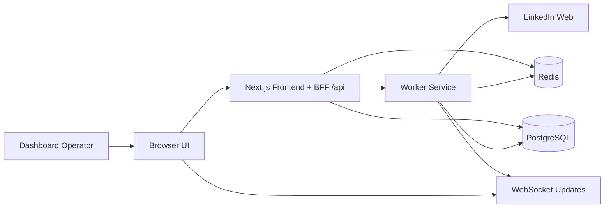
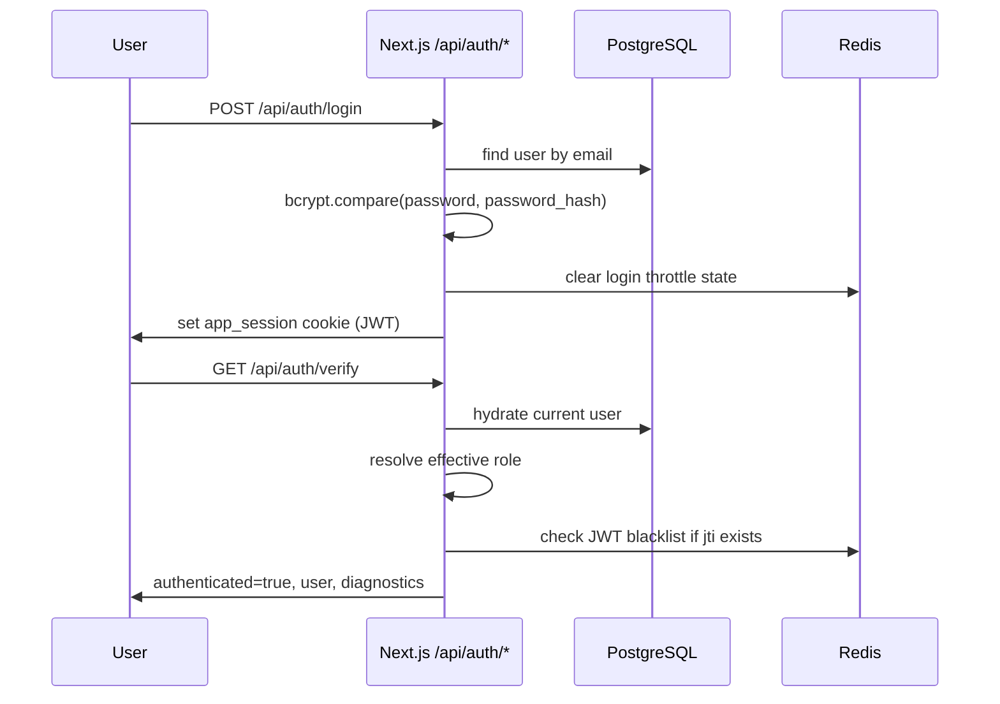
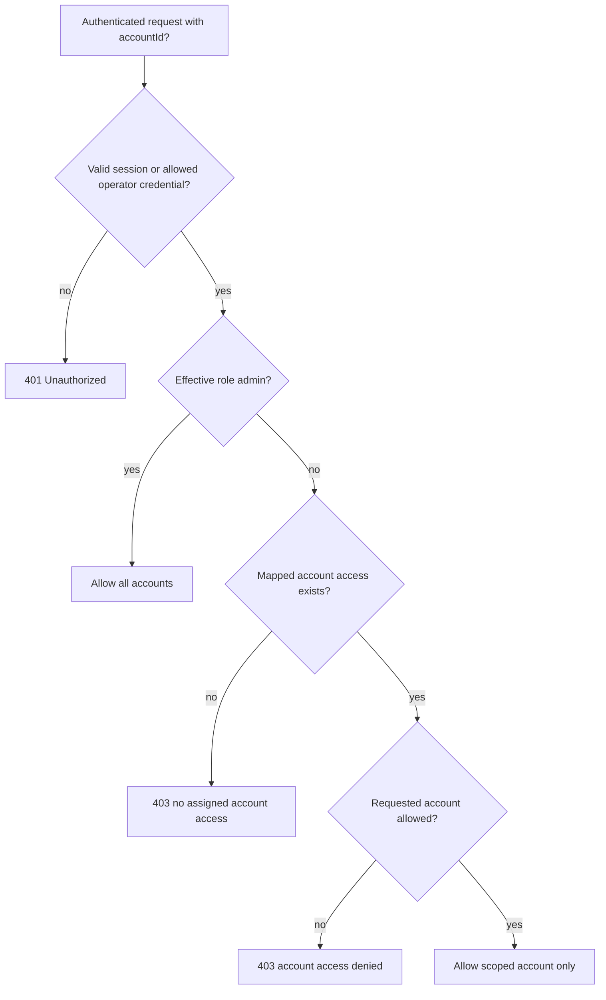
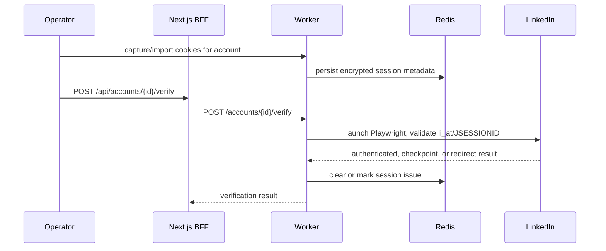
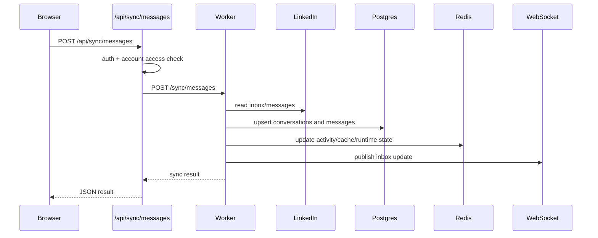
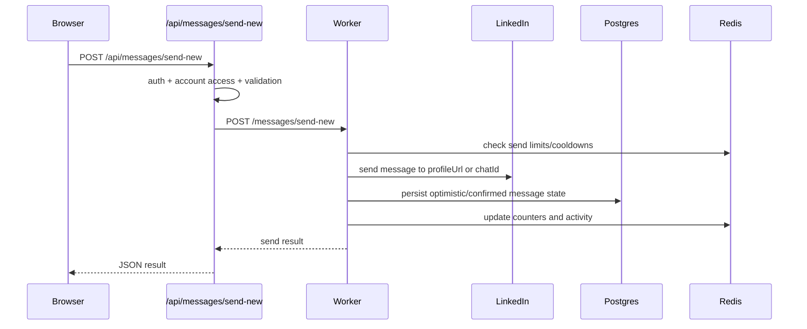

# Architecture

This document describes the production architecture of Linkedin-Hyper and the runtime contracts between the dashboard, BFF API routes, worker service, PostgreSQL, Redis, and LinkedIn browser automation.

## System Overview

## Core Services
### Frontend / Dashboard
The frontend is a Next.js App Router application that provides:
- dashboard pages
- inbox UI
- auth pages
- a BFF layer under `/api/*`

The BFF layer handles:
- dashboard session auth
- same-origin mutation protection
- account ownership checks
- forwarding requests to the worker with `X-Api-Key`
- filtering inbox results for non-admin users

### Worker Service
The worker is an Express application that owns:
- LinkedIn browser automation
- message sync
- message send
- conversation/thread reads
- metrics
- public and internal health endpoints
- WebSocket event publishing

Current entry layout:
- `worker/src/index.js` bootstraps the process
- `worker/src/server.js` creates the HTTP server and WebSocket server
- `worker/src/app.js` wires all worker routes and services

### PostgreSQL
PostgreSQL stores:
- dashboard users
- accounts
- conversations
- messages
- persisted authorization mappings if present

The inbox prefers database-backed reads and falls back to live worker reads only when necessary.

### Redis
Redis is used for:
- JWT blacklist/logout support
- rate limit counters
- session metadata
- activity logs
- inbox cache/fallback coordination
- worker metrics and runtime state

## Frontend Architecture
### Pages and panels
The dashboard contains:
- account/status views
- unified inbox
- auth flows
- operational views

Inbox behavior is designed to stay stable under background sync:
- active thread state is keyed to the selected conversation
- stale thread fetches are ignored
- scroll is preserved unless a real new message arrives
- reconnect state is shown as a subtle status indicator

### API boundary
The frontend never talks to LinkedIn directly. All browser actions go through:
1. Next.js BFF routes under `/api/*`
2. worker routes on `http://worker:3001`

This keeps cookies, worker API secret handling, and automation internals off the browser.

## Worker Architecture
Key worker route groups:
- `/accounts/*` for account registry, session import/status, limits
- `/verify/*` for LinkedIn verification
- `/sync/*` for message sync
- `/inbox/*` for unified inbox data
- `/messages/*` for threads and send flows
- `/connections/*` for connection views and requests
- `/stats/*` for activity data
- `/health/*` and `/metrics` for observability
- `/export/*` for CSV/JSON export

Key worker services:
- `accountRegistry` for known account resolution
- `messageSyncService` for sync orchestration and dedupe-aware persistence
- `inboxFallbackService` for cache/live inbox fallback
- `healthSummaryService` for summary and startup validation reports
- `jobExecutionService` for queue/direct-execution orchestration

## Authentication Flow

### Auth rules
- Login is email/password only.
- Passwords are stored as bcrypt hashes.
- Session cookies are HTTP-only and `SameSite=Strict`.
- `/api/auth/verify` refreshes stale session payloads if DB or env-driven role state changed.

## Account Access Flow

Resolution order:
1. DB user role
2. `INITIAL_ADMIN_EMAILS`
3. DB `user_account_access` mapping when present
4. `USER_ACCOUNT_ACCESS` env mapping

Behavior:
- Admin users can access all accounts.
- Non-admin users can access only assigned accounts.
- Unauthenticated callers get `401`.
- Authenticated but unauthorized callers get `403`.
- Missing or invalid account identifiers return `400`.

## LinkedIn Session Flow

Notes:
- Required cookies include `li_at` and `JSESSIONID`.
- The app does not bypass checkpoint/captcha/login friction.
- Session issues are surfaced as safe public error codes.

## Message Sync Flow

Sync protections:
- non-admin multi-account sync requires explicit `accountId`
- duplicate protection is enforced during persistence
- background refresh should not create duplicate rows for the same message

## Send Message Flow

Send flow notes:
- `/api/messages/send` is deprecated and returns `410`.
- `profileUrl` or `chatId` is required.
- message length is capped at 3000 characters.
- rate limits and cooldowns are enforced before/around send execution.

## WebSocket Flow
The worker owns the WebSocket server and emits inbox updates when sync/send operations change conversation state. The frontend uses reconnect-safe logic and should remain usable during transient disconnects.

Operational expectations:
- reconnect UI should be subtle
- thread state should remain stable during reconnect attempts
- reconnects must not duplicate message events or create send retries

## Health And Metrics
### Public worker health
`GET /health` reports:
- Redis dependency status
- database dependency status
- worker readiness
- browser manager state
- queue state

Critical healthy state requires both:
- Redis healthy
- database healthy

### Internal summary routes
Authenticated callers can request:
- `GET /api/health/summary`
- `GET /api/health/startup-validation`

Startup validation includes the stable account-access check:
- `id: account-access-config`
- `label: account-access-config`
- `title: Account access configuration`

### Metrics
Worker `GET /metrics` returns a JSON metrics snapshot for queue/browser/worker activity.

## Rate Limiting
Redis-backed controls cover:
- daily message limit
- hourly message limit
- minimum gap between sends
- burst limit window
- login throttle window

Relevant env vars include:
- `RATE_LIMIT_MESSAGES_SENT`
- `RATE_LIMIT_MESSAGES_SENT_HOURLY`
- `RATE_LIMIT_MESSAGES_SENT_MIN_GAP_SEC`
- `RATE_LIMIT_MESSAGES_SENT_BURST_LIMIT`
- `RATE_LIMIT_MESSAGES_SENT_BURST_WINDOW_SEC`
- `LOGIN_RATE_LIMIT_WINDOW_SEC`
- `LOGIN_RATE_LIMIT_MAX_ATTEMPTS`

## Inbox UI Notes
The production inbox uses:
- a white/blue theme with readable message bubbles
- stable conversation selection keyed by conversation ID
- guarded thread switching to avoid stale-response flashes
- scroll preservation when the user is not at the bottom
- a compact reconnect pill instead of a disruptive warning banner

## Trust Boundaries
- Browser never receives raw worker API secrets.
- LinkedIn cookies stay in worker/session storage, not the browser bundle.
- All account-scoped actions pass through BFF auth + account access checks.
- Same-origin mutation protection blocks unsafe browser-origin writes.

## Related Docs
- [DEPLOYMENT.md](DEPLOYMENT.md)
- [OPERATIONS_RUNBOOK.md](OPERATIONS_RUNBOOK.md)
- [SECURITY.md](SECURITY.md)
- [TESTING.md](TESTING.md)
- [SWAGGER_API.md](SWAGGER_API.md)
